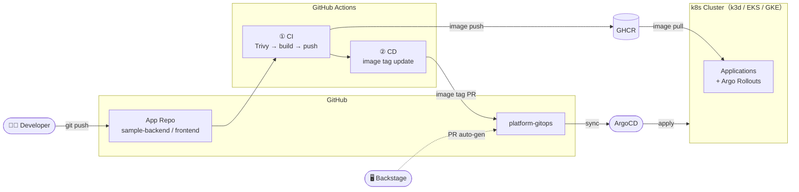
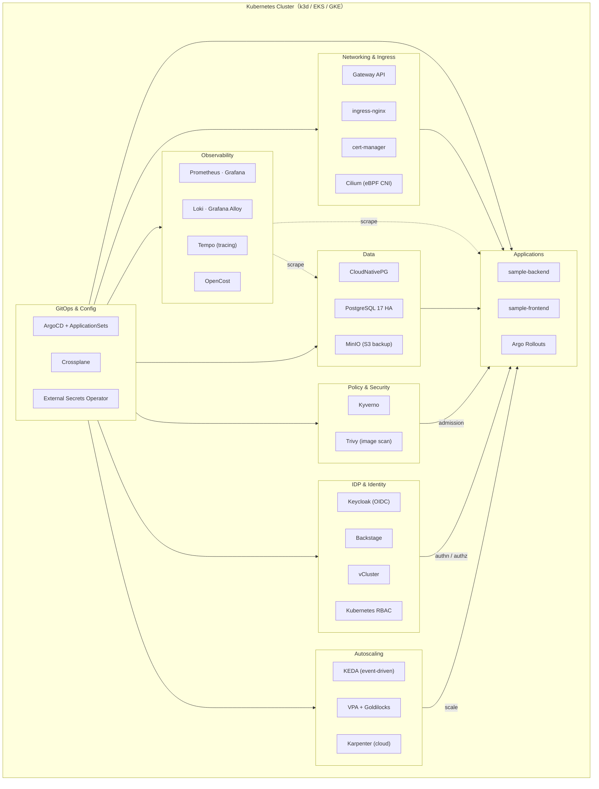

# Platform Engineering Portfolio

## About

私はITコンサルとして約5年、オンプレKubernetesクラスタの構築・運用支援に携わっています。
現場では構築フェーズから参画しており、設計への関与もありますが、
運用支援という立場だとオペレーション寄りに見えるため、
「設計から一貫して構築できる」ことを示す目的でこのポートフォリオを作りました。

現場に導入されていない仕組み（mise / Terraform / Secret管理 / CNPG / Tempo など）については、
改善提案に向けた検証も兼ねています。

現在 **Phase 10 まで完了**。次タスク：Pahse11 

---

## 構成リポジトリ

| リポジトリ | 役割 |
|---|---|
| [platform-infra](https://github.com/okccl/platform-infra) | k3d クラスタ IaC・ツール管理（mise）・Terraform（EKS） |
| [platform-gitops](https://github.com/okccl/platform-gitops) | ArgoCD による GitOps 管理・全プラットフォームコンポーネントの宣言 |
| [platform-charts](https://github.com/okccl/platform-charts) | Helm Library Chart（`common-app` / `common-db`）による抽象化層 |
| [sample-backend](https://github.com/okccl/sample-backend) | FastAPI + PostgreSQL によるサンプル API（Golden Path の利用例） |
| [sample-frontend](https://github.com/okccl/sample-frontend) | React + Vite によるサンプル SPA（Golden Path の利用例） |
|---|---|
| [platform-adr](https://github.com/okccl/platform-adr) | ADR ポートフォリオ全体における技術選定の意思決定の記録 |

## CI/CD フロー図

---

## クラスタ アーキテクチャ図

---

## Phase 構成

| Phase | テーマ | 解決すること |
|---|---|---|
| **0** | Local Foundation | `make init` 1コマンドで全ツールを再現。環境差異をコードで排除 |
| **1** | k3d Cluster IaC | `cluster.yaml` によるクラスタ構成の宣言化。1コマンドで作成・破棄・再作成 |
| **2** | GitOps & Secrets | ArgoCD による Git = クラスタ状態の実現。ESO で Secret をコードから分離 |
| **3** | Connectivity | ingress-nginx + cert-manager。`*.localhost` で即 HTTPS 公開できる基盤 |
| **4** | Observability | LGTM スタック（Loki / Grafana / Tempo / Mimir）でメトリクス・ログ・トレースを統合 |
| **5** | Platform Abstraction | Helm Library Chart で K8s マニフェストを抽象化。開発者は `values.yaml` だけ書けばよい |
| **6** | Golden Path (CI/CD) | push → イメージビルド → GitOps PR → ArgoCD 自動同期までを完全自動化 |
| **7** | Guardrail (Kyverno) | ポリシーエンジンで `latest` タグ禁止・リソース制限必須などをデプロイ前に強制 |
| **8** | Data & State | CNPG Operator による PostgreSQL HA 構成と MinIO を使ったバックアップ |
| **9** | Resilience & Chaos | 3ノード構成 + Anti-Affinity + `kubectl drain` による障害シミュレーションと RTO 計測 |
| **10** | DX & DR | SOPS × Age による Secrets as Code。`make init` 一発での DR 手順を確立 |
| **11** | Hardening & Exploration | Trivy / Argo Rollouts / KEDA / Crossplane / Cilium / Gateway API（ローカル検証）で各レイヤーを個別強化 |
| **12** | IDP（Internal Developer Platform） | Keycloak による SSO・認証認可の分離、Backstage によるセルフサービス窓口、vCluster による仮想クラスタ払い出し |
| **13** | Cloud Expansion（AWS） | Terraform + EKS に同じ GitOps フローを展開。Crossplane vs Terraform 比較、Gateway API・IRSA・Karpenter・ApplicationSets・OpenCost を検証 |
| **14** | Cloud Expansion (GCP) & Multi-Cloud Comparison | GKE に展開し AWS との差分を確認。Autopilot / Workload Identity / GKE Gateway / GMP など GCP ネイティブサービスと比較。Crossplane でマルチクラウド管理を実証 |

---

## 技術スタック

**Infrastructure / Cluster**
- k3d / kubectl / Helm v3 / mise / direnv
- Terraform（EKS） / Crossplane（provider-helm / provider-aws / provider-gcp）
- Cilium（eBPF CNI）/ vCluster

**GitOps / Secrets**
- ArgoCD v3 / ArgoCD ApplicationSets / External Secrets Operator / SOPS × Age
- AWS Secrets Manager / GCP Secret Manager（ESO 経由）

**Observability**
- kube-prometheus-stack（Prometheus v3 / Grafana）/ Loki / Grafana Alloy / Tempo
- OpenTelemetry（アプリ側トレーシング）
- Amazon Managed Prometheus / Google Managed Prometheus（クラウド比較）
- OpenCost（コスト可視化）

**Networking**
- ingress-nginx / cert-manager
- Gateway API / Envoy Gateway（ローカル）/ AWS LBC / GKE Gateway Controller（クラウド）

**Policy / Security**
- Kyverno（Validate / Mutate ポリシー）
- Trivy（イメージ脆弱性スキャン）

**Identity / Access**
- Keycloak（SSO / OIDC IdP）
- Kubernetes RBAC / ArgoCD RBAC
- IRSA（AWS）/ Workload Identity（GCP）

**IDP / Developer Experience**
- Backstage（サービスカタログ / Software Templates）

**Deployment Strategy**
- Argo Rollouts（カナリア / Blue-Green）

**Autoscaling**
- VPA / Goldilocks / HPA
- KEDA（イベント駆動オートスケール）
- Karpenter（ノードオートスケール / AWS）/ GKE Autopilot（GCP）

**Data**
- CloudNativePG（CNPG）/ PostgreSQL 17 / MinIO
- RDS（AWS）/ Cloud SQL（GCP）（マネージド比較）

**Resilience**
- Chaos Engineering（`kubectl drain`）/ Anti-Affinity

**Application**
- FastAPI / Python 3.12 / React + Vite / nginx / Docker / GHCR

**Cloud**
- AWS（EKS / RDS / Secrets Manager / ACM / ALB）
- GCP（GKE / Cloud SQL / Secret Manager / Cloud DNS）

---

## 開発環境

**ローカル**：WSL2（Ubuntu 24.04）+ Windows 11 Pro / i9 14900HX / 32GB RAM  
**クラウド**：AWS（EKS） / GCP（GKE）  
ツールバージョンは各リポジトリの `.mise.toml` を参照。
