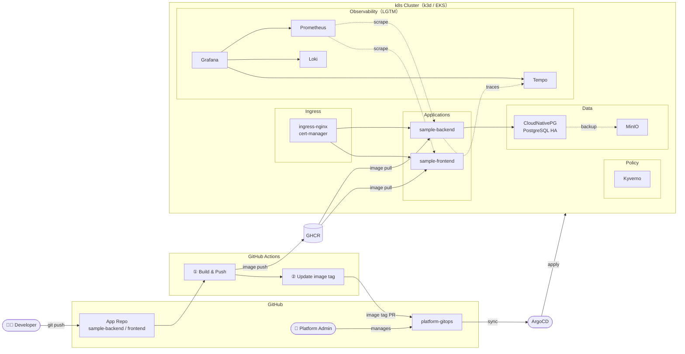

# Platform Engineering Portfolio

## About

私はITコンサルとして約5年、オンプレKubernetesクラスタの構築・運用支援に携わっています。
現場では構築フェーズから参画しており、設計への関与もありますが、
二次請け・運用支援という立場上、経歴だけではオペレーション寄りに見えることが多いため、
「設計から一貫して構築できる」ことを示す目的でこのポートフォリオを作りました。

現場に導入されていない仕組み（mise / Terraform / Secret管理 / CNPG / Tempo など）については、
改善提案に向けた検証も兼ねています。

現在 **Phase 10 の途中**。次タスク：DR演習とRTO実測

---

## 構成リポジトリ

| リポジトリ | 役割 |
|---|---|
| [platform-infra](https://github.com/okccl/platform-infra) | k3d クラスタ IaC・ツール管理（mise）・Terraform（EKS） |
| [platform-gitops](https://github.com/okccl/platform-gitops) | ArgoCD による GitOps 管理・全プラットフォームコンポーネントの宣言 |
| [platform-charts](https://github.com/okccl/platform-charts) | Helm Library Chart（`common-app` / `common-db`）による抽象化層 |
| [sample-backend](https://github.com/okccl/sample-backend) | FastAPI + PostgreSQL によるサンプル API（Golden Path の利用例） |
| [sample-frontend](https://github.com/okccl/sample-frontend) | React + Vite によるサンプル SPA（Golden Path の利用例） |

---

## Phase 構成

| Phase | テーマ | 解決したこと |
|---|---|---|
| **0** | Local Foundation | `make init` 1コマンドで全ツールを再現。環境差異をコードで排除 |
| **1** | k3d Cluster IaC | `cluster.yaml` によるクラスタ構成の宣言化。1コマンドで作成・破棄・再作成 |
| **2** | GitOps & Secrets | ArgoCD による Git = クラスタ状態の実現。ESO で Secret をコードから分離 |
| **3** | Connectivity | ingress-nginx + cert-manager。`*.localhost` で即 HTTPS 公開できる基盤 |
| **4** | Observability | LGTM スタック（Loki / Grafana / Tempo）でメトリクス・ログ・トレースを統合 |
| **5** | Platform Abstraction | Helm Library Chart で K8s マニフェストを抽象化。開発者は `values.yaml` だけ書けばよい |
| **6** | Golden Path (CI/CD) | push → イメージビルド → GitOps PR → ArgoCD 自動同期までを完全自動化 |
| **7** | Guardrail (Kyverno) | ポリシーエンジンで `latest` タグ禁止・リソース制限必須などをデプロイ前に強制 |
| **8** | Data & State | CNPG Operator による PostgreSQL HA 構成と MinIO を使ったバックアップ |
| **9** | Resilience & Chaos | 3ノード構成 + Anti-Affinity + `kubectl drain` による障害シミュレーションと RTO 計測 |
| **10** | DX & DR | SOPS × Age による Secrets as Code。`make init` 一発での DR 手順を確立 |
| **11** | Cloud Expansion | Terraform で EKS クラスタを構築し、同じ GitOps フローをクラウドへ展開 |

---

## 技術スタック

**Infrastructure / Cluster**
- k3d / kubectl / Helm v3 / mise / direnv / Terraform（EKS）

**GitOps / Secrets**
- ArgoCD v3 / External Secrets Operator / SOPS × Age

**Observability**
- kube-prometheus-stack（Prometheus v3 / Grafana）/ Loki / Grafana Alloy / Tempo
- OpenTelemetry（アプリ側トレーシング）

**Policy / Security**
- Kyverno（Validate / Mutate ポリシー）

**Data**
- CloudNativePG（CNPG）/ PostgreSQL 17 / MinIO

**Resilience**
- VPA / Goldilocks / Chaos Engineering（`kubectl drain`）

**Application**
- FastAPI / Python 3.12 / React + Vite / nginx / Docker / GHCR

---

## ローカル環境

WSL2（Ubuntu 24.04）+ Windows 11 Pro

| ツール | バージョン |
|---|---|
| k3d | 5.8.3 |
| kubectl | 1.35.3 |
| helm | 3.20.1 |
| argocd CLI | 3.2.9 |
| Docker Engine | 29.4.0 |
